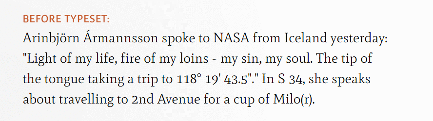

## PHP Typeset

PHP Typeset is a port of **[Typeset](https://github.com/davidmerfield/Typeset)** for JavaScript to PHP. Typeset is an HTML pre-processor for web typography. It provides correct quotation substitution, small-caps conversion, hyphenation, basic ligatures, hanging-punctuation, space substitution, and more.

Powered by [phpQuery](https://github.com/electrolinux/phpquery), this port for PHP 5.4+ retains all features, excluding hyphenation, which should be left up to the browser due to performance issues (it's recommended that you use **[Hypher](https://github.com/bramstein/hypher)** by Bram Stein as an alternative) and optical margin alignment (David disabled this in the JS version due to accessibility issues). It introduces the following modules:

- Simple math conversion (multiplication, division, exponents) (disabled by default)
- Ordinal wrapping (1st, 2nd ...)
- Number wrapping added to the small-caps conversion (module has been renamed for this purpose) (can be disabled)
- Conversion of parenthesised marks to their proper equivalents: © ℗ ® ℠ ™
- Basic symbol conversion (numero, silcrow/section symbol) (disabled by default)

See inside the class for more information.

### Usage

This hasn't been uploaded to Packagist. For now, simply use this to import the package:

```php
require_once 'Typeset.php';
```

Create a new Typeset object. Note that `hanging_punctuation` and `capitals_numbers` is disabled by default, for performance reasons, and `simple_math` is disabled as it is experimental. You can also opt to ignore specific elements by means of a CSS selector, and, where available, disable certain aspects of specific modules.

```php
$typeset = new Typeset(); // or

$typeset = new Typeset([]); // to enable all features, or

$typeset = new Typeset([
	// Disable a module; overrides the default (see __construct):
    'disable' => ['hanging_punctuation'],
    // Don't allow Typeset to process any of these:
    'ignore' => '.skip, #anything, .which-matches',
    // Disable number-wrapping in the capitals_numbers module:
    'capitals_numbers' => ['disable_numbers'],
    // Turn off specific symbol conversions
    'symbols' => ['disable_numero', 'disable_interrobang', 'disable_silcrow'],
]);
```

Rename the classes that Typeset gives to `span` elements (optional):

```php
$typeset->classCapitals = 'small-caps'; // default: 'capitals'
$typeset->classNumber = 'numerics'; // default: 'number'
$typeset->classOrdinal = 'ord'; // default: 'ordinal'; set blank to remove class
$typeset->classExponent = 'exp'; // default: 'exponent'; set blank to remove class
```

And *GO!*

```
$html = $typeset->typeset($html);
```

### Some notes

**In ALPHA, this PHP Typeset is currently under development, and is subject to change.**

Additionally, when changes are made to the JS version of Typeset, they will be mirrored here, if possible. The following JS to-do items will also be incorporated here when implemented:

- [Dewidowing](https://github.com/davidmerfield/Typeset/issues/34), *may* be implemented before David implements it.
- Remove recursion from `nodes()`. I'm not incredibly familiar with DOM-traversal, and so I'll leave this up to David.

Lastly:

- There is no CLI access... yet.
- Tests are forthcoming. Please don't use in production (unless you trust me) until the tests are up.

### License

In keeping with the spirit of the original Typeset for JavaScript, PHP Typeset is also dedicated to the public domain and licensed under **[CC0](LICENSE.md)**.